# __Neural Architectures for Named Entity Recognition__

__Guillaume Lample, Miguel Ballesteros, Sandeep Subramanian, Kazuya Kawakami, Chris Dyer__  
*Carnegie Mellon University, NLP Group of Pompeu Fabra University*  
*NAACL'16*

## __1. Motivation__
### __1.1 Challenges__
- Only a very small amount of supervised training data available.
- Few constraints of words that can be names.

### __1.2 Solutions__
- Hand-crafted features & domain-specific knowledge
    - costly in new languages and new domains.
- Unsupervised learning (but to augment rather than replace)

## __2. Methods__
### __2.1 Input Word Embedding__
#### __2.1.1 Intuitions__
- Many languages have orthographic or morphological evidence that something is a name. -> Use a model that constructs representations of words from representations of the characters.
- Names appear in regular contexts in large corpora. -> Use embeddings learned from a large corpus that are sensitive to word order.

#### __2.1.2 Character-based models of words__
##### __2.1.2.1 Advantages__
- Useful for morphologically rich languages and to handle the out-of-vocabulary problem.

##### __2.1.2.2 Framework__
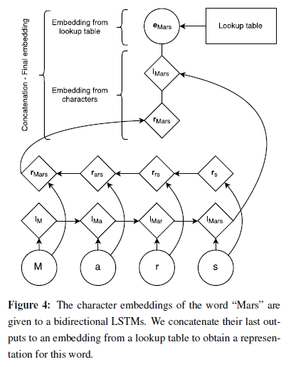  

- Use pretrained word embedding (skip-n-gram) to initialize lookup table.
- The embedding for a word derived from its characters is the concatenation of its forward and backward representations from the bidirectional LSTM.
- Then the character-level representation is concatenated with a word-level representation from a word lookup-table.
- To encourage the model to depend on both representations, use dropout training.

### __2.2 LSTM-CRF Model__
#### __2.2.1 Traditional CRF__
##### __2.2.1.1 Notations__
- P is the matrix of scores output by the bidirectional LSTM network. P is of size n * k, where k is the number of distinct tags, and P\_{i,j} is the score of the j^th tag of the i^th word in a sentence.
- A is a matrix of transition scores such that A\_{i,j} represents the score of a transition from the tag i to tag j. y\_0 and y\_n are the __start__ and __end__ tags of a sentence, that we add to the set of possible tags. A is therefore a square matrix of size k + 2.

##### __2.2.1.2 Formulations__
- Predictions' Scores  
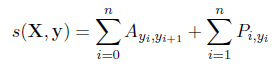
- Training  
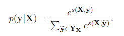  

- Decoding  
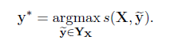

#### __2.2.2 Framework__
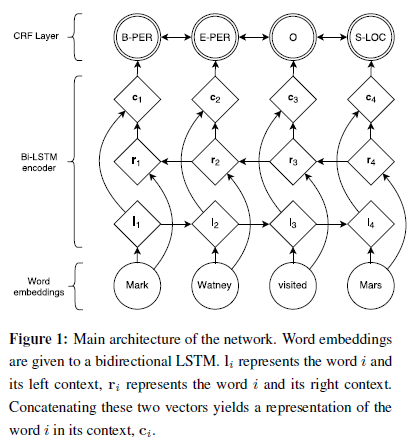  

- The representation of a word using this model is obtained by concatenating its left and right context representations, c\_i = [l\_i;r\_i];
- Then c_i was linearly projected onto a layer whose size is equal to the number of distinct tags.
- Use a CRF as previously described to take into account neighboring tags, yielding the final predictions for every word y_i.

### __2.3 Transition-Based Chunking Model__
#### __2.3.1 Stack Long Short-Term Memories (Reference)__
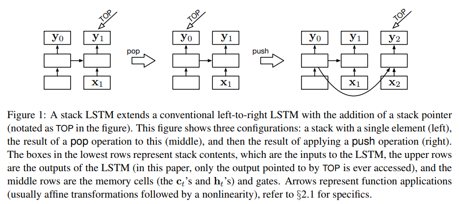  
    
    // Transition-Based Dependency Parsing with Stack Long Shrot-Term Memory

- The LSTM with a "stack pointer".
- The **POP** operation moves the stack pointer to the previous element.
- The **PUSH** adds a new entry at the end of the list.

#### __2.3.2 Transitions__
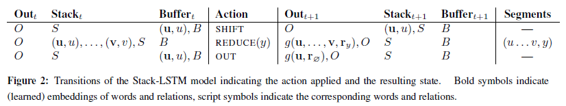  

- Make use of two stacks (output and stack) and a buffer.
- The **SHIFT** transition moves a word from the buffer to the stack.
- The **OUT** transition moves a word from the buffer directly into the output stack
- The **REDUCE(y)** transition pops all items from the top of the stack creating a "chunk" labels this with label y, and pushes a representation of this chunk onto the output stack.

#### __2.3.3 Chunking Algorithm__
- Use stack LSTMs to compute a fixed dimensional embedding of stack, buffer, and output, and take a concatenation of them.
- This representation is used to define a distribution over the possible actions that can be take at each time step.

#### __2.3.3 Example: Mark Watney visited Mars.__
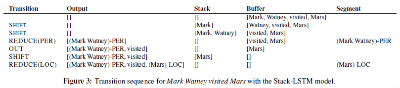

- **Representing Labeled Chunks**: run a bidirectional LSTM over the embeddings of its constituent tokens together with a token representing the type of the chunk being identified, given as g(u, ..., v, r_y), where r_y is a learned embedding of a label type. 

### __2.4. IOBES Tagging Schemes__
- I -> Inside;
- O -> Outside;
- B -> Beginning;
- E -> the End of named entities;
- S -> Singleton entities.

## __3. Experiments__
### __3.1 Datasets__
- CoNLL-2002 and CoNLL-2003 datasets that contain independent named entity labels for English, Spanish, German and Dutch.
- All datasets contain four different types of named entities: locations, persons, organizations, and miscellaneous entities.

### __3.2 Results__
#### __3.2.1 English NER results (CoNLL-2003 test set)__
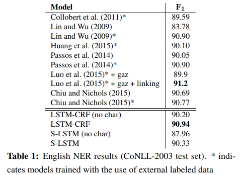

#### __3.2.2 German NER results (CoNLL-2003 test set)__
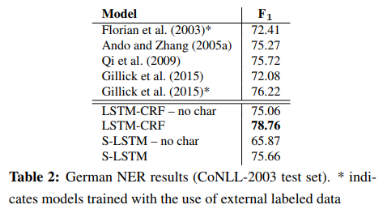

#### __3.2.3 Dutch NER results (CoNLL-2002 test set)__
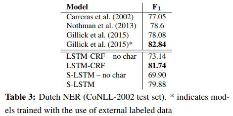

#### __3.2.4 Spanish NER results (CoNLL-2002 test set)__

#### __3.2.5 Different configurations (English)__
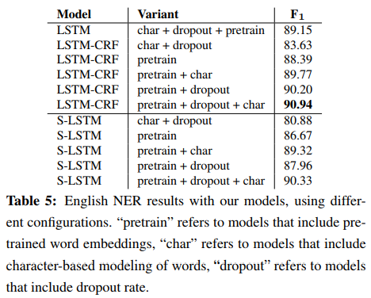

## __4. Related Works__
- Carreras (2002): combining several small fixed-depth decision trees;
- Florian (2003): combining the output of four diverse classifiers;
- Qi (2009): proving with a neural network by doing unsupervised learning on a massive unlabeled corpus;
- Collobert (2011): a CNN over a sequence of word embedding with a CRF layer on top;
- Huang (2015): LSTM-CRF with hand-crafted spelling features;
- Zhou and Xu (2015): adapting to the semantic role labeling task;
- Lin and Wu (2009): a linear chain CRF with L2 regularization, and add phrase cluster features extracted from the web data and spelling features;
- Passos (2014): a linear chain CRF with spelling features and gazetteers.
- Cucerzan and Yarowsky (1999;2002): semi-supervised bootstrapping algorithms for NER by co-training character-level and token-level features;
- Eisenstein (2011): Bayesian nonparametrics to construct a database of named entities in an almost unsupervised setting;
- Ratinov and Roth (2009): using a regularized average perceptron and aggregating context information;
- Gillick (2015): think as a sequence to sequence learning problem and incorporate character-based representations into their encoder model;
- Chiu and Nichols (2015): use CNNs to learn character-level features.

## __5. Shortcomings & Improvements__
- add some hand-crafted features or domain-spefic knowledge that is different from char-level.

## __6. ReadList__
- [Ballesteros et al.2015] Miguel Ballesteros, Chris Dyer, and Noah A. Smith. 2015. Improved transition-based
dependency parsing by modeling characters instead of words with LSTMs. In Proceedings of EMNLP.
- [Bengio et al.1994] Yoshua Bengio, Patrice Simard, and Paolo Frasconi. 1994. Learning long-term dependencies
with gradient descent is difficult. Neural Networks, IEEE Transactions on, 5(2):157–166.
- [Carreras et al.2002] Xavier Carreras, Llu´ıs Marquez, and `Llu´ıs Padro. 2002. Named entity extraction using ad- ´
aboost, proceedings of the 6th conference on natural language learning. August, 31:1–4.
- [Chiu and Nichols2015] Jason PC Chiu and Eric Nichols. 2015. Named entity recognition with bidirectional lstm-cnns. arXiv preprint arXiv:1511.08308.
- [Cucerzan and Yarowsky1999] Silviu Cucerzan and David Yarowsky. 1999. Language independent named entity recognition combining morphological and contextual evidence. In Proceedings of the 1999 Joint SIGDAT Conference on EMNLP and VLC, pages 90–99.
- [Cucerzan and Yarowsky2002] Silviu Cucerzan and David Yarowsky. 2002. Language independent ner using a unified model of internal and contextual evidence. In proceedings of the 6th conference on Natural language learning-Volume 20, pages 1–4. Association for Computational Linguistics.
- [Dyer et al.2015] Chris Dyer, Miguel Ballesteros, Wang Ling, Austin Matthews, and Noah A. Smith. 2015. Transition-based dependency parsing with stack long short-term memory. In Proc. ACL.
- [Eisenstein et al.2011] Jacob Eisenstein, Tae Yano, William W Cohen, Noah A Smith, and Eric P Xing. 2011. Structured databases of named entities from bayesian nonparametrics. In Proceedings of the First Workshop on Unsupervised Learning in NLP, pages 2–12. Association for Computational Linguistics.
- [Florian et al.2003] Radu Florian, Abe Ittycheriah, Hongyan Jing, and Tong Zhang. 2003. Named entity recognition through classifier combination. In Proceedings of the seventh conference on Natural language learning at HLT-NAACL 2003-Volume 4, pages 168–171. Association for Computational Linguistics.
- [Hoffart et al.2011] Johannes Hoffart, Mohamed Amir Yosef, Ilaria Bordino, Hagen Furstenau, Manfred ¨Pinkal, Marc Spaniol, Bilyana Taneva, Stefan Thater, and Gerhard Weikum. 2011. Robust disambiguation of named entities in text. In Proceedings of the Conference
on Empirical Methods in Natural Language Processing, pages 782–792. Association for Computational Linguistics.
- [Huang et al.2015] Zhiheng Huang, Wei Xu, and Kai Yu. 2015. Bidirectional LSTM-CRF models for sequence tagging. CoRR, abs/1508.01991.
- [Lafferty et al.2001] John Lafferty, Andrew McCallum, and Fernando CN Pereira. 2001. Conditional random fields: Probabilistic models for segmenting and labeling sequence data. In Proc. ICML.
- [Luo et al.2015] Gang Luo, Xiaojiang Huang, Chin-Yew Lin, and Zaiqing Nie. 2015. Joint named entity recognition and disambiguation. In Proc. EMNLP.
- [Qi et al.2009] Yanjun Qi, Ronan Collobert, Pavel Kuksa, Koray Kavukcuoglu, and Jason Weston. 2009. Combining labeled and unlabeled data with word-class distribution learning. In Proceedings of the 18th ACM conference on Information and knowledge management, pages 1737–1740. ACM.
- [Ratinov and Roth2009] Lev Ratinov and Dan Roth. 2009. Design challenges and misconceptions in named entity recognition. In Proceedings of the Thirteenth Conference on Computational Natural Language Learning, pages 147–155. Association for Computational Linguistics.
- [Santos and Guimaraes2015] ˜ Cicero Nogueira dos Santos and Victor Guimaraes. 2015. Boosting named entity ˜ recognition with neural character embeddings. arXiv preprint arXiv:1505.05008.
- [Tjong Kim Sang and De Meulder2003] Erik F. Tjong Kim Sang and Fien De Meulder. 2003. Introduction to the conll-2003 shared task: Language-independent named entity recognition. In Proc. CoNLL.
- [Tjong Kim Sang2002] Erik F. Tjong Kim Sang. 2002. Introduction to the conll-2002 shared task: Languageindependent named entity recognition. In Proc. CoNLL.
